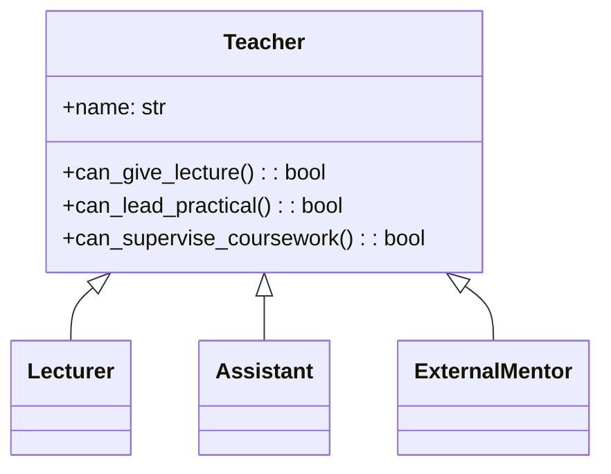
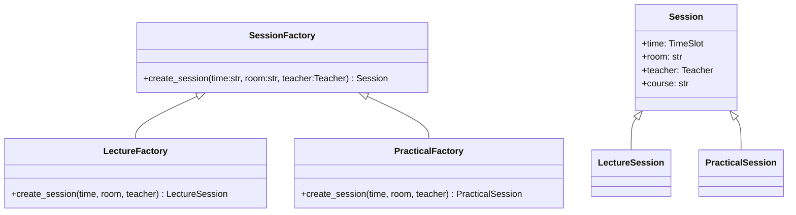
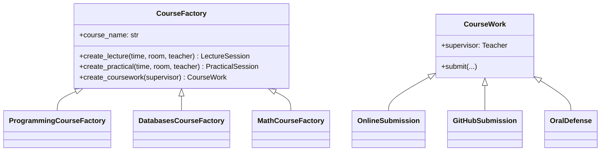
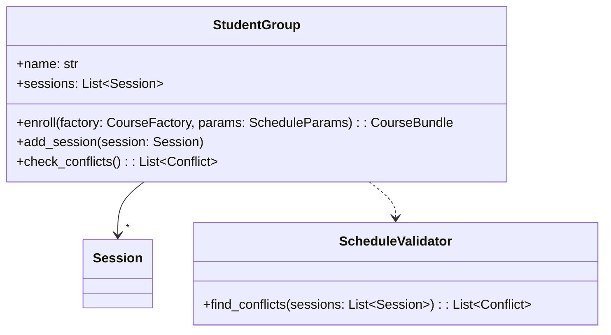

## Teachers

```mermaid
classDiagram
    class Teacher {
        +name: str
        +can_give_lecture(): bool
        +can_lead_practical(): bool
        +can_supervise_coursework(): bool
    }
    class Lecturer
    class Assistant
    class ExternalMentor

    Teacher <|-- Lecturer
    Teacher <|-- Assistant
    Teacher <|-- ExternalMentor
```

## Factory Method (Sessions)

```mermaid
classDiagram
    class SessionFactory {
        +create_session(time:str, room:str, teacher:Teacher) Session
    }
    class LectureFactory {
        +create_session(time, room, teacher) LectureSession
    }
    class PracticalFactory {
        +create_session(time, room, teacher) PracticalSession
    }
    SessionFactory <|-- LectureFactory
    SessionFactory <|-- PracticalFactory

    class Session {
        +time: TimeSlot
        +room: str
        +teacher: Teacher
        +course: str
    }
    class LectureSession
    class PracticalSession
    Session <|-- LectureSession
    Session <|-- PracticalSession
```

## Abstract Factory (Course families)

```mermaid
classDiagram
    class CourseFactory {
        +course_name: str
        +create_lecture(time, room, teacher) LectureSession
        +create_practical(time, room, teacher) PracticalSession
        +create_coursework(supervisor) CourseWork
    }
    class ProgrammingCourseFactory
    class DatabasesCourseFactory
    class MathCourseFactory
    CourseFactory <|-- ProgrammingCourseFactory
    CourseFactory <|-- DatabasesCourseFactory
    CourseFactory <|-- MathCourseFactory

    class CourseWork {
        +supervisor: Teacher
        +submit(...)
    }
    class OnlineSubmission
    class GitHubSubmission
    class OralDefense
    CourseWork <|-- OnlineSubmission
    CourseWork <|-- GitHubSubmission
    CourseWork <|-- OralDefense
```

## Student group & conflicts

```mermaid
classDiagram
    class StudentGroup {
        +name: str
        +sessions: List~Session~
        +enroll(factory: CourseFactory, params: ScheduleParams): CourseBundle
        +add_session(session: Session)
        +check_conflicts(): List~Conflict~
    }
    class ScheduleValidator {
        +find_conflicts(sessions: List~Session~): List~Conflict~
    }
    StudentGroup --> "*" Session
    StudentGroup ..> ScheduleValidator
```
