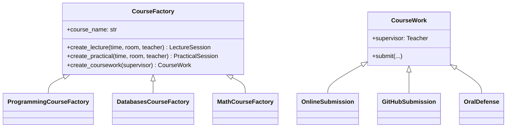

# Abstract Factory (Course families)

```mermaid
classDiagram
    class CourseFactory {
        +course_name: str
        +create_lecture(time, room, teacher) LectureSession
        +create_practical(time, room, teacher) PracticalSession
        +create_coursework(supervisor) CourseWork
    }
    class ProgrammingCourseFactory
    class DatabasesCourseFactory
    class MathCourseFactory
    CourseFactory <|-- ProgrammingCourseFactory
    CourseFactory <|-- DatabasesCourseFactory
    CourseFactory <|-- MathCourseFactory

    class CourseWork {
        +supervisor: Teacher
        +submit(...)
    }
    class OnlineSubmission
    class GitHubSubmission
    class OralDefense
    CourseWork <|-- OnlineSubmission
    CourseWork <|-- GitHubSubmission
    CourseWork <|-- OralDefense
```
