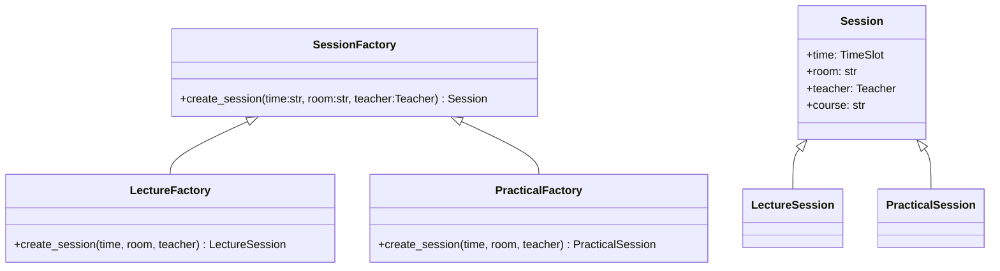

# Factory Method (Sessions)

```mermaid
classDiagram
    class SessionFactory {
        +create_session(time:str, room:str, teacher:Teacher) Session
    }
    class LectureFactory {
        +create_session(time, room, teacher) LectureSession
    }
    class PracticalFactory {
        +create_session(time, room, teacher) PracticalSession
    }
    SessionFactory <|-- LectureFactory
    SessionFactory <|-- PracticalFactory

    class Session {
        +time: TimeSlot
        +room: str
        +teacher: Teacher
        +course: str
    }
    class LectureSession
    class PracticalSession
    Session <|-- LectureSession
    Session <|-- PracticalSession
```
