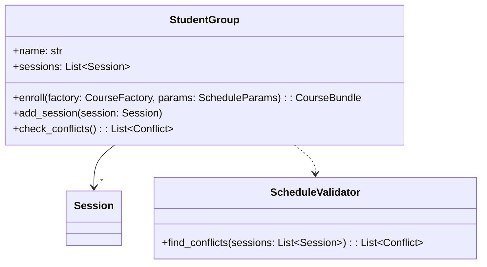

# Student group & conflicts

```mermaid
classDiagram
    class StudentGroup {
        +name: str
        +sessions: List~Session~
        +enroll(factory: CourseFactory, params: ScheduleParams): CourseBundle
        +add_session(session: Session)
        +check_conflicts(): List~Conflict~
    }
    class ScheduleValidator {
        +find_conflicts(sessions: List~Session~): List~Conflict~
    }
    StudentGroup --> "*" Session
    StudentGroup ..> ScheduleValidator
```
