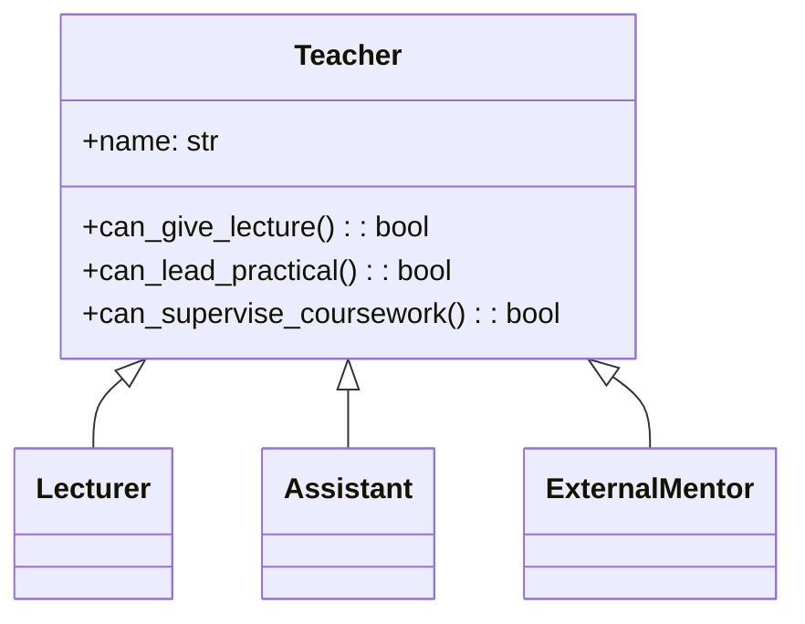

# Teachers (UML)

```mermaid
classDiagram
    class Teacher {
        +name: str
        +can_give_lecture(): bool
        +can_lead_practical(): bool
        +can_supervise_coursework(): bool
    }
    class Lecturer
    class Assistant
    class ExternalMentor

    Teacher <|-- Lecturer
    Teacher <|-- Assistant
    Teacher <|-- ExternalMentor
```
